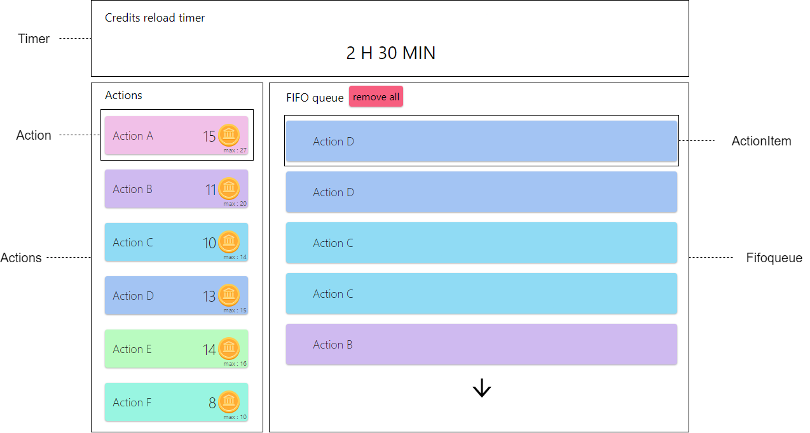
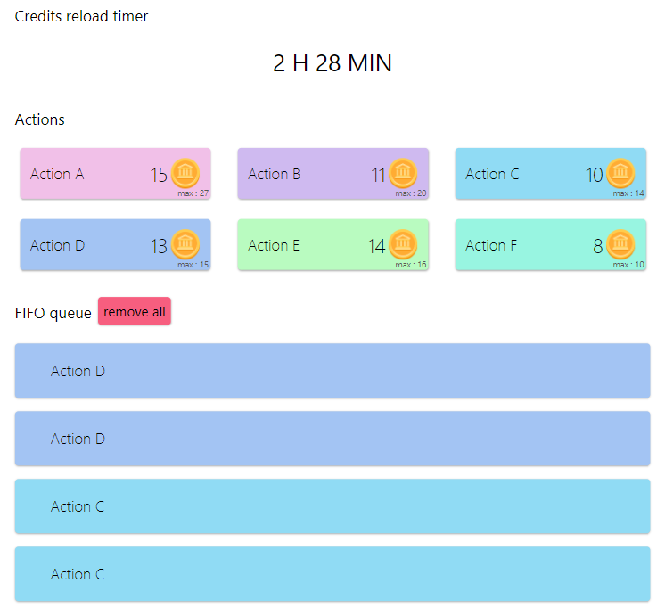

# waalaxy-recruitment-test

## Get started du projet

Clone the backend and frontend

```
> git clone https://github.com/Julien-Wiegandt/waaalaxy-recruitment-api.git

> git clone https://github.com/Julien-Wiegandt/waalaxy-recruitment-test.git
```

Start React frontend app

```
> cd waalaxy-recruitment-test
```

```
> npm run start
```

Run test

```
> cd waalaxy-recruitment-test
```

```
> npm run test
```

Run backend app
Run test

```
> cd waaalaxy-recruitment-api
```

```
> node server.js
```

## Introduction

Bonjour !

Voici mon travail sur le deuxieme test de recrutement chez Waalaxy. Les consignes et documentation du travail rendu sont dispomible ci-dessous.

Il etait attendu 2 heures de travail, etant donne que les consignes ne donne pas de limitations precises du projet, j'ai pris plus de 2 heures pour faire certainement un peu plus qu'attendu.

## Consignes

```
Re,

Du coup voici le deuxième test technique :

Nous avons un système de queue FIFO.

Soit des actions liées à des crédits. Effectuer une action coûte un crédit. Chaque action possède ses propres crédits.

Les crédits sont recalculés pour l'utilisateur si au moins 24 heures sont passées depuis le dernier calcul. Chaque action possède une valeur maximale de crédits définis par le développeur.

Les crédits seront calculés de manière aléatoire entre 80% et 100% de la valeur maximale.

Un utilisateur peut ajouter autant d'actions qu'ils souhaitent dans sa queue.

Les actions sont triées.

Exemple :

Je suis dans un système avec 3 actions, A, B, C ayant respectivement 20, 20, 30 en valeur maximale.

L'utilisateur après le premier calcul possède en crédits (toujours dans l'ordre A, B, C) 18, 20, 29.

Il ajoute 2 actions A, puis 5 B puis 2 C puis 2 A.

Il aura donc une queue [A, A, B, B, B, B, B, C, C, A, A]

Objectif :

Tu devras rendre un code mettant en place le système décrit ci-dessus.

- On doit pouvoir ajouter des actions à la queue.
- Afficher la queue.

Des tests devront être écrits.

Voici quelques consignes supplémentaires :

- Langages autorisés : Typescript, Javascript
- Le code devra être exécutable via un *npm run start.*
- Les tests devront être exécutable via un *npm run test*
- Aucune limite de temps
- Review du code en direct avec phases de questions
Si tu as des questions n'hésite pas :)
```

## Travail effectue

### Frontend React typeScript

 **_Interface grand ecran_**

L'interface React est composee de differents composents fonctionnels :

- Timer
  - Il regarde la date actuelle au chargement de la page et recupere la date du dernier rechargement des credits dans le localStorage. Si les dates sont espaces de 24h, alors les credits de l'utilisateurs sont recharges, sinon rien.
  - Un timer est initialise au chargement, il prend la valeur du temps restant jusqu au prochain rechargement, et permet un rechargement dynamique lorsqu'il atteint 0.
- Actions
  - Prend des actions en parametre et fait un .map sur celles ci en appelant Action, un composant reutilisable.
  - Action prend une action en parametre et se charge d'afficher ses informations.
  - Lors du clique sur une action, une fonction dans la view principale 'Fifo' sera appele en callback et se chargera d'ajouter une action dans la Fifoqueue.
- Fifoqueue
  - Prend une fifo queue d'action en parametre et fait un .map sur celles ci en appelant ActionItem, un composant reutilisable.
  - ActionItem prend une action en parametre et se charge d'afficher les informations voulues.
  - Un bouton 'remove all' est disponible appeler une fonction en callback dans la view 'Fifo' pour supprimer les elements de la fifo queue.
  - Une fleche est affiche si la fifo queue a plus de 5 actions, pour affiche ou non le reste des actions.

 **_Interface tablette_**

Tout les composants sont appele dans la view Fifo.

La view gere le responsive des composants, mais aussi toute la logique de l'application. En effet, au chargement elle va faire un call API pour recuperer les credits de l'utilisateur sur chaque action, ainsi que la derniere fifo queue d'actions. Elle prend en charge les ajouts ou modification de la fifo queue, ainsi que le rechargement ou l'utilisation de credits d'action, du cote frontend et backend.

### Backend Node.js

J'ai fait une tres petite API REST permettant de stocker en dur les credits de l'utilisateur, ainsi que sa fifo queue.

**routes**

| Methode | URL        | Donnees                                          | Description                                                                    |
| :-----: | ---------- | ------------------------------------------------ | ------------------------------------------------------------------------------ |
|   GET   | /credits   | [{credits:number, name:string}]                  | Recupere les credits de l'utilisateur associe a des actions.                   |
|   PUT   | /credits   | [{credits:number, name:string}]                  | Remplace les credits de l'utilisateur, par ceux envoyes depuis le frontend.    |
|   GET   | /fifoqueue | [{name:string, maxCredits:number, color:string}] | Recupere la fifo queue de l'utilisateur.                                       |
|   PUT   | /fifoqueue | [{name:string, maxCredits:number, color:string}] | Remplace la fifo queue de l'utilisateur, par celle envoyee depuis le frontend. |

### Tests

Je n'ai jamais fait de tests tres pousse dans mon experience malheureusement, j'ai hate de voir les process de tests types qu'un developpeur fullstack MERN fait.

J'ai cependant, fait des tests sur le rendu et les boutons de mes composents fonctionnels React. (disponible sous ./src/tests).
